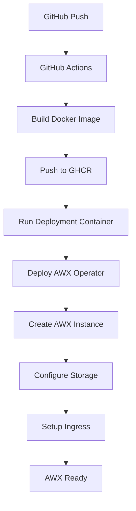

# Architecture Overview

## Deployment Flow

## Components

### 1. AWX Operator
- **Purpose**: Manages AWX lifecycle on Kubernetes
- **Namespace**: `awx-system`
- **Source**: Official Ansible AWX Operator

### 2. AWX Instance
- **Purpose**: The actual AWX application
- **Namespace**: `awx`
- **Components**:
  - AWX Web UI
  - AWX Task Manager
  - PostgreSQL Database
  - Redis Cache

### 3. Storage
- **Type**: HostPath (for single-node clusters)
- **Volumes**:
  - PostgreSQL data: `/opt/awx/postgres`
  - Project files: `/opt/awx/projects`

### 4. Networking
- **Service**: ClusterIP
- **Ingress**: nginx with SSL/TLS
- **Domain**: `awx.sin.padminisys.com`
- **Certificate**: Let's Encrypt via cert-manager

## Resource Requirements

### Minimum Requirements
- **CPU**: 2 cores
- **Memory**: 4GB RAM
- **Storage**: 16GB available disk space
- **Kubernetes**: v1.20+

### Recommended for Production
- **CPU**: 4+ cores
- **Memory**: 8GB+ RAM
- **Storage**: 50GB+ SSD storage
- **Database**: External PostgreSQL cluster

## Security Considerations

1. **RBAC**: AWX operator uses cluster-admin (required for operator functionality)
2. **Secrets**: Admin password stored in Kubernetes secret
3. **TLS**: Automatic SSL certificate via cert-manager
4. **Network**: Ingress-based access with HTTPS enforcement

## Scaling Considerations

### Single Node (Current Setup)
- HostPath storage
- All components on one node
- Suitable for development/testing

### Multi-Node (Future)
- Shared storage (NFS, Ceph, etc.)
- Multiple AWX replicas
- Database clustering
- Load balancing
